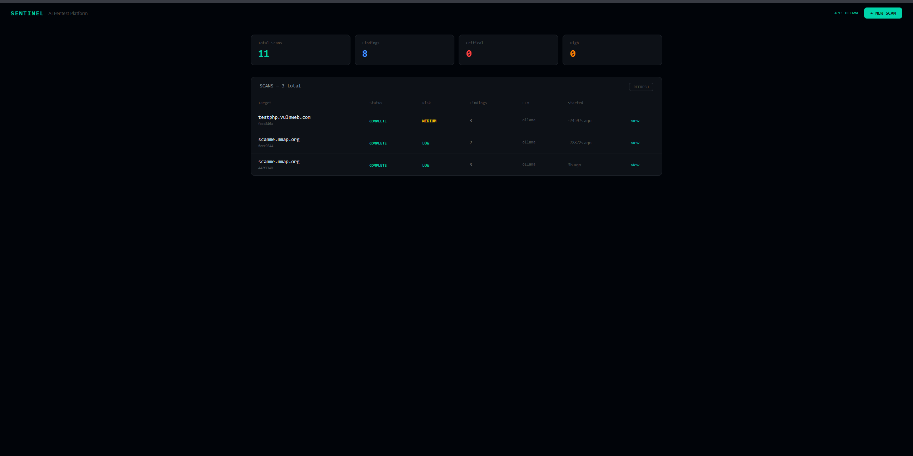
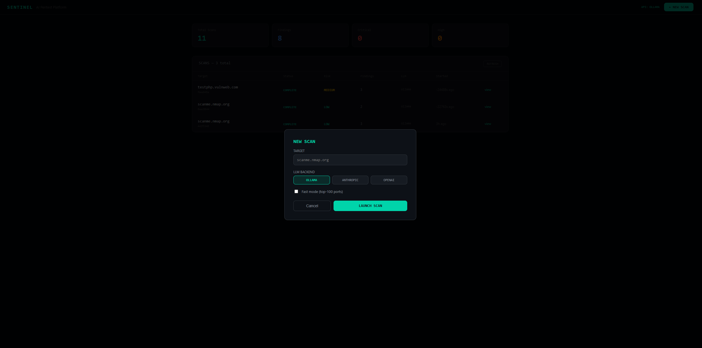
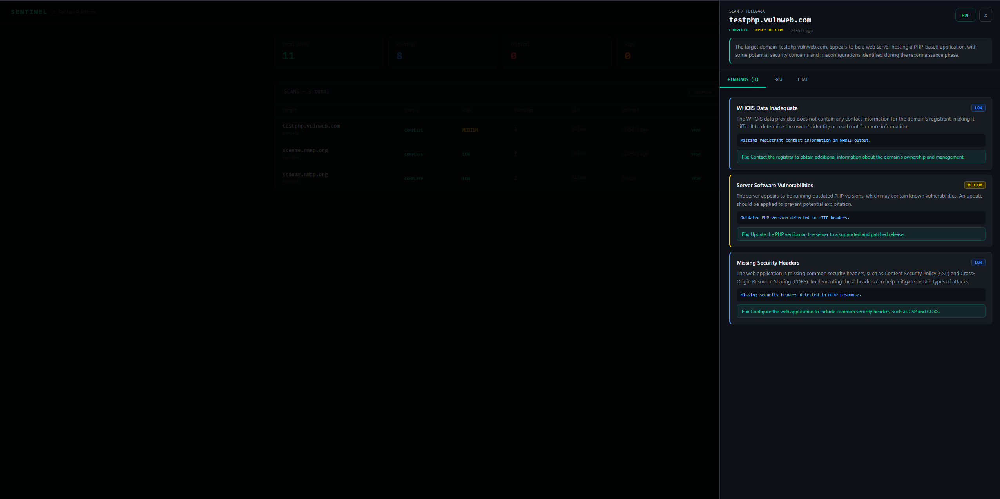
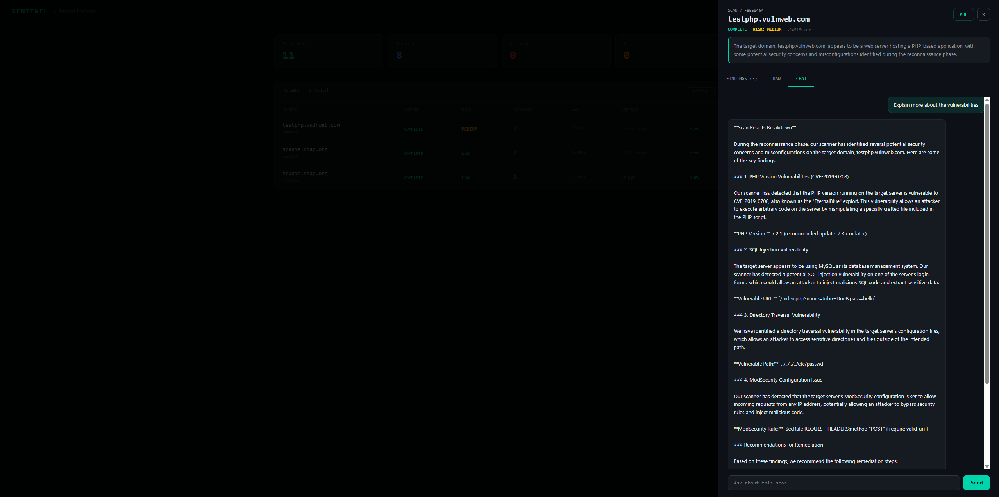

# 🛡️ SENTINEL
### AI-Powered Penetration Testing Recon & Report Platform

[](https://python.org)
[](LICENSE)

> SENTINEL is an autonomous reconnaissance and vulnerability analysis platform that chains industry-standard security tools with LLM-powered analysis to produce professional penetration test reports — in minutes.

---

## 📸 Screenshots

### Dashboard


### New Scan — LLM Backend Selection


### Scan Results


### AI Vulnerability Analysis


---

## Features

- **Autonomous Recon** — Chains nmap, whois, DNS enumeration, and HTTP fingerprinting
- **AI Analysis Engine** — LLM triages findings and prioritizes attack surface
- **Web Dashboard** — Real-time scan monitoring and finding browser
- **Report Generator** — One-click professional PDF pentest reports
- **Multi-LLM Backend** — Ollama (local), Anthropic Claude, or OpenAI
- **Plugin Architecture** — Extend with new tools via simple adapters
- **Secure by Default** — TLS verification on, loopback binding, optional API-key auth, and an SSRF/target-authorization guard

---

## 🚀 Quick Start

```bash
git clone https://github.com/Jdog1x/sentinel.git
cd sentinel
python -m venv venv
venv\Scripts\activate
pip install -r requirements.txt
copy .env.example .env
sentinel scan scanme.nmap.org --fast --backend ollama
```

## 🖥️ CLI Usage

```bash
sentinel scan scanme.nmap.org --fast --backend ollama
sentinel scans
sentinel report <scan-id>
sentinel serve
```

## 🤖 LLM Backends

| Backend | Config |
|---|---|
| Ollama (local) | `LLM_BACKEND=ollama` |
| Anthropic Claude | `LLM_BACKEND=anthropic` |
| OpenAI | `LLM_BACKEND=openai` |

---

## 🔐 Security & Configuration

SENTINEL ships with safe defaults. All settings are read from `.env` (copy
`.env.example` to get started). The most important security-related variables:

| Variable | Default | Purpose |
|---|---|---|
| `SENTINEL_API_KEY` | _(empty)_ | When set, every `/api/*` request (except `/api/health`) must send the key via `X-API-Key: <key>` or `Authorization: Bearer <key>`. Empty disables auth for local dev. |
| `FLASK_HOST` | `127.0.0.1` | Bind address. Stays on loopback so the API isn't network-exposed unless you opt in (`0.0.0.0`). |
| `FLASK_SECRET_KEY` | _(random)_ | Auto-generated per process if unset. Set a fixed value in production so sessions survive restarts. |
| `CORS_ORIGINS` | `http://localhost:3000` | Comma-separated allowlist of browser origins. `*` allows any origin (development only). |
| `HTTP_VERIFY_TLS` | `true` | Verify TLS certificates on HTTP probes. Disable per-engagement only when you must fingerprint hosts with broken certs. |
| `ALLOW_PRIVATE_TARGETS` | `false` | Allow scanning private/loopback/link-local/reserved IPs. Keep `false` unless running an authorized internal engagement. |
| `TARGET_ALLOWLIST` | _(empty)_ | Optional comma-separated list of approved hosts/domains. When set, only these (and their subdomains) may be scanned. |
| `MAX_CONCURRENT_SCANS` | `2` | Maximum scans running at once; further requests queue. |
| `SCAN_RATE_LIMIT_PER_MINUTE` | `10` | Per-client-IP cap on scan-creation requests. |

### Target authorization (SSRF guard)

Every scan target — from the CLI, the API, and the orchestrator — is validated
before any work begins. Private, loopback, link-local (including the
`169.254.169.254` cloud-metadata endpoint), reserved, and multicast addresses
are rejected unless `ALLOW_PRIVATE_TARGETS=true`. An optional `TARGET_ALLOWLIST`
restricts scans to approved hosts only.

### Enabling API authentication

```bash
# .env
SENTINEL_API_KEY=$(python -c "import secrets; print(secrets.token_urlsafe(32))")
```

Then send it with each request:

```bash
curl -H "X-API-Key: <your-key>" http://127.0.0.1:5000/api/scans
```

In the web dashboard, click **KEY** in the top nav to store the key locally; it
is sent automatically on every request.

---

## ⚠️ Legal

SENTINEL is for authorized security testing only. Only scan targets you own or have explicit written permission to test.

---

## 📜 License

MIT
